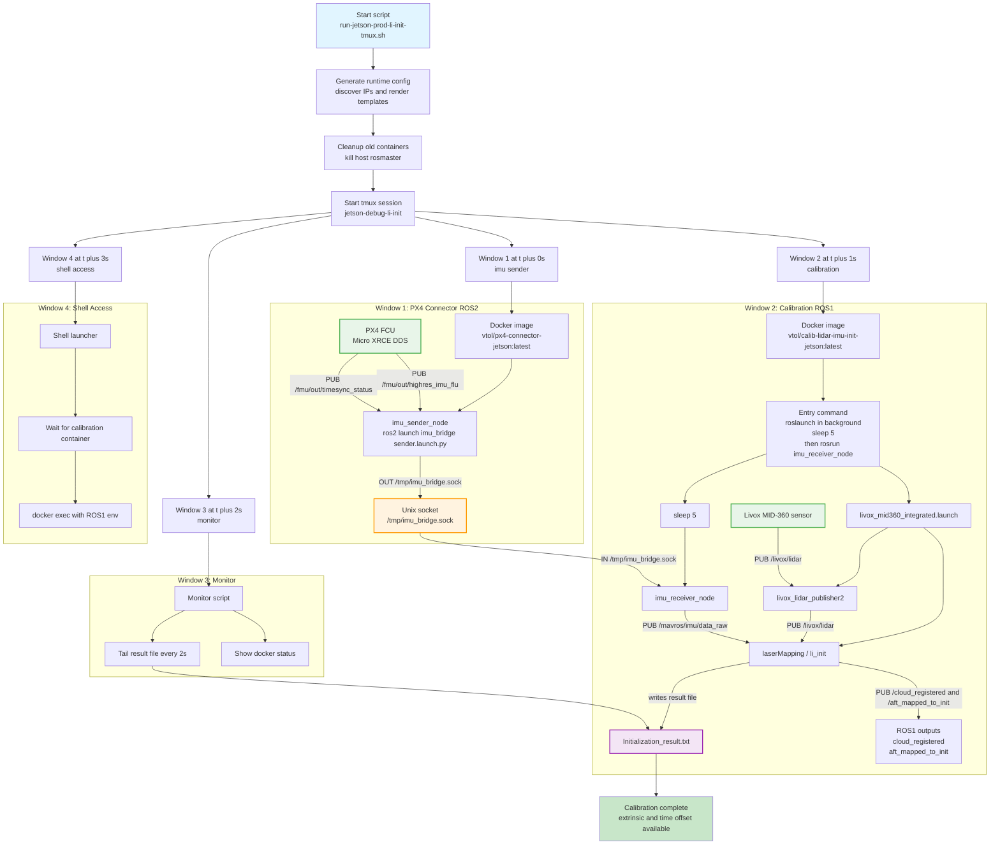
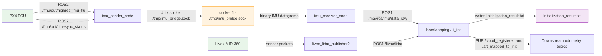

# RealWorld Modules — Jetson Run Scripts & Integration Workflows

This repository provides the assembly-layer run scripts, configuration templates, and integration workflows for the VTOL Jetson production stack. Subfolders (`linker/`, `tools/`, `vtol_behavior_manager/`) are developed independently; this root directory orchestrates them into easy-to-use pipelines.

## Repository Overview

| Category | Scripts | Purpose |
|----------|---------|---------|
| **Production Stack** | `production.sh`, `run-jetson-prod-linker.sh`, `run-jetson-prod-bht.sh` | Full or partial production pipelines |
| **LiDAR-IMU Init** | `run-jetson-prod-li-init-tmux.sh` | Real-time LiDAR-IMU calibration |
| **Neural Inference** | `run-jetson-prod-neural-infer.sh` | Standalone behavior-policy inference |
| **Debug / Host** | `run-host-debug-*`, `run-jetson-debug-*` | Local development and debugging tools |
| **Utilities** | `tmux_utils.sh`, `host-sync-policies.sh`, `kill_all.sh` | Shared helpers and ops scripts |

The rest of this document provides a detailed deep-dive into the **LiDAR-IMU initialization pipeline** (`run-jetson-prod-li-init-tmux.sh`). For other pipelines, refer to the inline comments in each script.

## Overview

The pipeline orchestrates three main components in a tmux session:
1. **PX4 Connector** - ROS2 IMU bridge (PX4 → Unix socket)
2. **Calibration** - LiDAR-IMU initialization (ROS1)
3. **Monitor** - Real-time status and result viewer

## Pipeline Flowchart (Timeline + Topics)



## Topic Map

### ROS2 Topics (PX4 Connector Container)

| Node | Direction | Topic | Message Type | Notes |
|------|-----------|-------|--------------|-------|
| `imu_sender_node` | **SUB** | `/fmu/out/highres_imu_flu` | `px4_msgs/msg/HighresImu` | From PX4 via UXRCE-DDS agent |
| `imu_sender_node` | **SUB** | `/fmu/out/timesync_status` | `px4_msgs/msg/TimesyncStatus` | Time sync status |
| `imu_sender_node` | **OUT** (socket) | `/tmp/imu_bridge.sock` | Unix DGRAM socket | Raw binary: `{uint64_t ts; float accel[3]; float gyro[3]}` |

### ROS1 Topics (Calibration Container)

| Node | Direction | Topic | Message Type | Notes |
|------|-----------|-------|--------------|-------|
| `livox_lidar_publisher2` | **PUB** | `/livox/lidar` | `sensor_msgs/PointCloud2` | Livox MID-360, 10 Hz |
| `livox_lidar_publisher2` | **PUB** | `/livox/imu` | `sensor_msgs/Imu` | Built-in IMU (optional) |
| `imu_receiver_node` | **SUB** | `/tmp/imu_bridge.sock` | Unix DGRAM socket | Receives from imu_sender_node |
| `imu_receiver_node` | **PUB** | `/mavros/imu/data_raw` | `sensor_msgs/Imu` | ROS1 IMU for LI-Init |
| `laserMapping` (`li_init`) | **SUB** | `/livox/lidar` | `sensor_msgs/PointCloud2` | Point cloud input |
| `laserMapping` (`li_init`) | **SUB** | `/mavros/imu/data_raw` | `sensor_msgs/Imu` | IMU input |
| `laserMapping` (`li_init`) | **PUB** | `/cloud_registered` | `sensor_msgs/PointCloud2` | LIO odometry output |
| `laserMapping` (`li_init`) | **PUB** | `/aft_mapped_to_init` | `nav_msgs/Odometry` | Full odometry with pose |
| `laserMapping` (`li_init`) | **PUB** | `/Laser_map` | `sensor_msgs/PointCloud2` | Global map |
| `laserMapping` (`li_init`) | **PUB** | `/cloud_registered_body` | `sensor_msgs/PointCloud2` | Body-frame point cloud |
| `laserMapping` (`li_init`) | **PUB** | `/cloud_effected` | `sensor_msgs/PointCloud2` | Effective points after filter |
| `laserMapping` (`li_init`) | **PUB** | `/livox/imu/async` | `sensor_msgs/Imu` | Synchronized IMU output |

## Startup Sequence & Timeline

### Wall-clock Timeline

| Time (s) | Event | Component | Details |
|----------|-------|-----------|---------|
| T+0.0 | Script start | `run-jetson-prod-li-init-tmux.sh` | Parse args, validate Docker images |
| T+0.5 | Config generation | Host | Render `livox_mid360.json`, `fastlio_mid360.yaml` with discovered IPs |
| T+0.8 | Cleanup | Host | `docker stop/rm` old containers, `pkill rosmaster` on port 11311 |
| T+1.0 | tmux session | tmux | Create `jetson-debug-li-init` with 4 windows |
| T+1.2 | Window 1 start | px4-connector container | `docker run` with `ros2 launch imu_bridge sender.launch.py` |
| T+1.5 | `imu_sender_node` ready | ROS2 | Subscribes to `/fmu/out/highres_imu_flu`, starts sending to `/tmp/imu_bridge.sock` |
| T+2.0 | Window 2 start | calib container | Execute bash command sequence |
| T+2.1 | Integrated launch | calib container | `roslaunch lidar_imu_init livox_mid360_integrated.launch &` (background) |
| T+2.2 | Livox & LI-Init nodes | calib container | `livox_lidar_publisher2` and `laserMapping` start simultaneously |
| T+2.5 | Livox hardware init | Livox MID-360 | Power-on self-test, Ethernet negotiation (~3–5 s) |
| T+5.0 | First point cloud | `livox_lidar_publisher2` | `/livox/lidar` first PointCloud2 message published |
| T+7.1 | imu_receiver_node start | calib container | `rosrun imu_bridge_ros1 imu_receiver_node` (after 5 s sleep from T+2.1) |
| T+7.2 | First IMU message | `imu_receiver_node` | `/mavros/imu/data_raw` begins publishing |
| T+7.3 | Full data streams | LI-Init (`laserMapping`) | Both `/livox/lidar` and `/mavros/imu/data_raw` available; calibration starts |
| T+15.0+ | Result file updates | LI-Init | `Initialization_result.txt` incrementally written (extrinsic, time offset) |
| T+15.0+ | Monitor tail | Monitor window | Shows real-time calibration progress (refresh 2 s) |
| T+15.0+ | Shell windows | tmux | `calib-shell` ready for interactive access |

### Startup Logic (Dependency Graph)

```
imu_sender_node (ROS2)
    │
    └─► /tmp/imu_bridge.sock (Unix socket)
            │
            ├─► imu_receiver_node (ROS1) ──┐
            │                               │
            │                               ▼
            │                        /mavros/imu/data_raw
            │                               │
            │                               ▼
            └──────────────────────► laserMapping (LI-Init)
                                          │
                                          ▼
                               /livox/lidar (from Livox MID-360)
                                          │
                                          ▼
                               Initialization_result.txt
```

**Key dependencies**:
1. **imu_sender_node** must start **before** imu_receiver_node (socket must exist)
2. **livox_lidar_publisher2** must publish `/livox/lidar` **before** LI-Init can process point clouds
3. **imu_receiver_node** starts **5 s after** LI-Init launch — LI-Init will wait for IMU messages
4. **Monitor** starts immediately and polls the result file every 2 s

## Component Details

### Window 1: IMU Sender (ROS2)
- **Container**: `vtol/px4-connector-jetson:latest`
- **Process**: `ros2 launch imu_bridge sender.launch.py`
- **Node**: `imu_sender_node`
- **Role**: Subscribes to PX4 IMU topic (`/fmu/out/highres_imu_flu`) and forwards data via Unix datagram socket
- **Socket**: `/tmp/imu_bridge.sock` (shared via `--ipc=host`)
- **ROS Domain**: `ROS_DOMAIN_ID=30`
- **DDS**: FastRTPS with debug profile (`fastdds-debug.xml`)

### Window 2: Calibration (ROS1)
- **Container**: `vtol/calib-lidar-imu-init-jetson:latest`
- **Launch file**: `livox_mid360_integrated.launch` (includes both Livox driver + LI-Init)
- **Processes**:
  1. **Livox driver** (`livox_lidar_publisher2`) — Publishes `/livox/lidar` point clouds
  2. **LI-Init** (`laserMapping`) — Subscribes to `/livox/lidar` and `/mavros/imu/data_raw`, runs calibration
  3. **IMU receiver** (`imu_receiver_node`) — Reads from socket, publishes `/mavros/imu/data_raw` (starts 5 s after LI-Init)
- **Config**: Auto-generated `livox_mid360.json` with discovered IPs
- **Output**: `Initialization_result.txt` (extrinsic, time offset, gravity, IMU bias)

### Window 3: Monitor
- **Script**: Bash loop tailing `Initialization_result.txt` every 2 seconds
- **Shows**:
  - Container status (`docker ps`)
  - Real-time calibration result (extrinsic convergence)
  - Topic availability checks

### Window 4: Shell Access
- Waits for calibration container, then provides interactive bash
- ROS1 environment sourced (`/opt/ros/noetic`, `/root/catkin_ws/devel/setup.bash`)

## Data Flow (Topic-Level)



## Runtime Modes

### Live Sensor Mode (Default)
```bash
./run-jetson-prod-li-init-tmux.sh
```
- Discovers LiDAR IP via ARP on `enP8p1s0`
- Generates Livox config with host/LiDAR IPs
- Starts live sensor data pipeline

### Bag Playback Mode
```bash
./run-jetson-prod-li-init-tmux.sh --bag /path/to/calibration.bag
```
- Plays bag file instead of live Livox driver
- Useful for offline calibration/testing

## Prerequisites

### Docker Images (must be built first)
```bash
# In linker/ directory
make docker-build-px4-connector-jetson
make docker-build-calib-jetson
```

### Network
- Interface: `enP8p1s0` (Jetson Ethernet)
- Convention: Host `192.168.55.100`, LiDAR `192.168.55.1`
- ROS Domain: `30` (isolated from other ROS2 networks)

### Host Cleanup
- Kills any running `rosmaster`/`roscore` on port 11311
- Allows container to bind ROS master port

## tmux Session Management

```bash
# Attach to session
tmux attach-session -t jetson-debug-li-init

# Switch windows (prefix + <number>)
#   C-b 1 → IMU Sender
#   C-b 2 → Calibration
#   C-b 3 → Monitor
#   C-b 4 → Calib Shell

# Detach (keep running)
C-b d

# Kill session
tmux kill-session -t jetson-debug-li-init
```

## Key Files

| File | Purpose |
|------|---------|
| `run_scripts/production.sh` | Full production stack (PX4 + LIO + neural gate + inference) |
| `run_scripts/run-jetson-prod-linker.sh` | PX4 connector + LIO pipeline only |
| `run_scripts/run-jetson-prod-li-init-tmux.sh` | LiDAR-IMU initialization entry script |
| `run_scripts/run-jetson-prod-neural-infer.sh` | Standalone neural inference on Jetson |
| `run_scripts/tmux_utils.sh` | tmux orchestration helpers |
| `run_scripts/config/fastdds-debug.xml` | FastDDS discovery profile (ROS2) |
| `run_scripts/config/livox_mid360.json` | Livox MID-360 driver template |
| `run_scripts/config/fastlio_mid360.yaml` | FAST-LIO config template |

## Output & Results

### Calibration Result File
```
/root/catkin_ws/src/LiDAR_IMU_Init/result/Initialization_result.txt
```

Contains:
- **Extrinsic translation** (T): [x, y, z] in meters
- **Extrinsic rotation** (R): quaternion [x, y, z, w]
- **Time offset**: temporal calibration (seconds)
- **Gravity**: [x, y, z] in m/s²
- **IMU bias**: [ax, ay, az, gx, gy, gz]

### ROS Topics (ROS1)
- `/livox/lidar` - Raw point cloud (Livox driver)
- `/mavros/imu/data_raw` - IMU data (ROS1)
- `/cloud_registered` - LIO output (if LIO window enabled in debug)

### ROS Topics (ROS2)
- `/imu_raw` - PX4 IMU (ROS2, in PX4 connector container)

## Troubleshooting

### LiDAR IP Not Discovered
Check interface and connections:
```bash
ip addr show dev enP8p1s0
ip neigh show dev enP8p1s0
```
Manually set in script: `HOST_IP` / `LIDAR_IP` variables (lines 109-110).

### Container Image Missing
Build with linker Makefile targets:
```bash
cd linker
make docker-build-px4-connector-jetson
make docker-build-calib-jetson
```

### Socket Permission Error
Ensure containers use `--ipc=host` (already set in script). Verify socket exists:
```bash
ls -la /tmp/imu_bridge.sock
```

### Monitor Shows "Waiting for result file..."
Calibration not yet complete. Ensure sufficient excitation (rotate/translate LiDAR). See [Excitation Guidelines](../linker/LiDAR_IMU_Init/README.md#excite-the-sensors).

## Next Steps

After successful calibration:
1. Copy extrinsic/time offset from `Initialization_result.txt`
2. Update `fastlio_mid360.yaml` in LIO config
3. Run integrated LIO+calibration pipeline (`run-jetson-prod-linker.sh` or `production.sh --skip-infer`) for continuous odometry

## References

- [LI-Init Paper (IEEE IROS 2022)](https://ieeexplore.ieee.org/document/9982225)
- [LiDAR-IMU Init README](../linker/LiDAR_IMU_Init/README.md)
- [IMU Bridge Architecture](../linker/IMU_BRIDGE_README.md)
