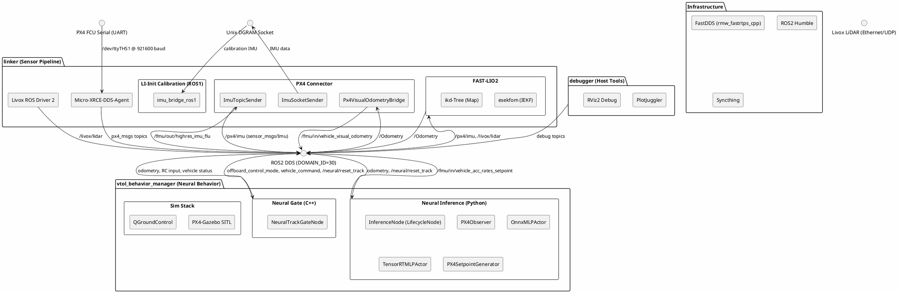
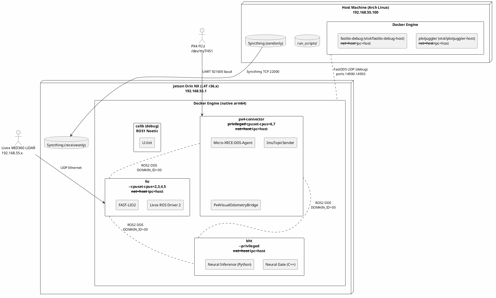
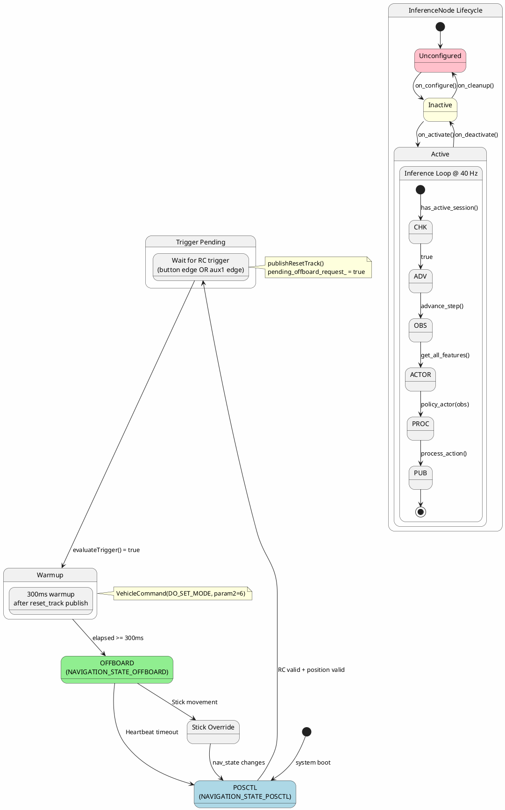
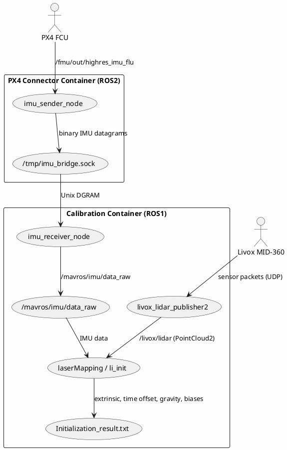

# Architecture Diagrams

> Auto-generated by /doc-sync 2026-05-31. Diagrams show relationships inferred from source code only.

## Component Diagram — Modules, Packages, ROS Nodes

**Source anchors:**
- NeuralGate: `vtol_behavior_manager/src/neural_gate/src/neural_gate_track.hpp`
- InferenceNode: `vtol_behavior_manager/src/neural_inference/scripts/neural_infer_entrypoint_node.py`
- PX4Observer: `vtol_behavior_manager/src/neural_inference/neural_inference/features/observer_px4.py`
- OnnxMLPActor: `vtol_behavior_manager/src/neural_inference/neural_inference/control/actor_mlp_onnx.py`
- PX4SetpointGenerator: `vtol_behavior_manager/src/neural_inference/neural_inference/control/generator_px4_setpoint.py`
- ImuTopicSender: `linker/px4_connector/src/src/imu_topic_sender.cpp`
- ImuSocketSender: `linker/px4_connector/src/src/imu_socket_sender.cpp`
- Px4VisualOdometryBridge: `linker/px4_connector/src/src/px4_visual_odometry_bridge.cpp`
- FAST-LIO2: `linker/lidar_connector/FAST_LIO_ROS2/src/IMU_Processing.hpp`
- Livox Driver: `linker/lidar_connector/livox_ros_driver2/src/livox_ros_driver2.cpp`
- run-jetson-prod-all.sh: `run_scripts/run-jetson-prod-all.sh`

---

## Deployment Diagram — Containers, Hosts, Hardware

**Source anchors:**
- `run_scripts/run-jetson-prod-all.sh` — image names, container configs, CPU pinning
- `linker/Makefile` lines 136-142 — docker run flags
- `sync_service/sync_env` — IPs, user, folders
- `run_scripts/config/fastdds-local.xml` — 127.0.0.1 only
- `run_scripts/config/fastdds-debug.xml` — multi-interface
- `run_scripts/config/px4-entrypoint.sh` — device, baudrate
- `vtol_behavior_manager/dockerfiles/bht.jetson.Dockerfile`
- `run-host-debug-px4-plotjuggler.sh`, `run-host-debug-lio-rviz.sh` — host debug

---

## Data-Flow Diagram — ROS2 Topics and IPC

```plantuml
@startuml
skinparam backgroundColor #FEFEFE

rectangle "PX4 FCU (Micro-XRCE-DDS Client)" as PX4 {
  (fmu/out/highres_imu_flu) as IMUOUT
  (fmu/out/vehicle_odometry) as ODOMOUT
  (fmu/out/vehicle_status_v1) as STATOUT
  (fmu/out/manual_control_setpoint) as RCOUT
  (fmu/in/vehicle_visual_odometry) as VIOIN
  (fmu/in/offboard_control_mode) as OFFIN
  (fmu/in/vehicle_command) as CMDIN
  (fmu/in/vehicle_acc_rates_setpoint) as ACCIN
}

rectangle "PX4 Connector Container" as PX4CONT {
  (/px4/imu :: sensor_msgs/Imu) as IMUBRIDGE
  (/Odometry :: nav_msgs/Odometry ENU/FLU) as ODOMBRIDGE
}

rectangle "LIO Container" as LIOCONT {
  (/livox/lidar :: PointCloud2) as LIVOXPC
  (/Odometry :: nav_msgs/Odometry ENU/FLU) as LIOODOM
  (/cloud_registered :: PointCloud2) as CLOUDREG
}

rectangle "BHT Container" as BHTCONT {
  (/neural/reset_track :: Bool) as RESETTRACK
  (VehicleAccRatesSetpoint) as ACCSETPT
}

' Data flow connections
IMUOUT --> IMUBRIDGE : "HighresImu FLU"
IMUBRIDGE --> LIOODOM : "/px4/imu"
LIVOXPC --> LIOODOM : "/livox/lidar"
LIOODOM --> ODOMBRIDGE : "ENU/FLU"
ODOMBRIDGE --> VIOIN : "NED/FRD"

ODOMOUT --> BHTCONT : "VehicleOdometry"
RCOUT --> BHTCONT : "RC input"
STATOUT --> BHTCONT : "nav_state"
RESETTRACK --> BHTCONT : "track reset"
ACCSETPT --> ACCIN : "thrust + rates"

CLOUDREG --> BHTCONT : "debug"

@enduml
```

**Source anchors:**
- `vtol_behavior_manager/src/neural_gate/src/neural_gate_track.hpp` lines 60-111
- `vtol_behavior_manager/src/neural_inference/scripts/neural_infer_entrypoint_node.py` lines 84-86, 105-117
- `vtol_behavior_manager/src/neural_inference/neural_inference/control/generator_px4_setpoint.py`
- `linker/px4_connector/src/src/imu_socket_sender.cpp`
- `linker/px4_connector/src/src/px4_visual_odometry_bridge.cpp`
- `run_scripts/config/px4-entrypoint.sh` lines 30-40

---

## State Machine — Neural Gate and Inference Lifecycle

**Source anchors:**
- `vtol_behavior_manager/src/neural_gate/src/neural_gate_track.hpp` lines 173-206 — tick
- lines 113-136 — evaluateTrigger
- lines 138-165 — offboard heartbeat/command
- lines 29-34 — config: button_mask=1024, aux1 thresholds, warmup=300ms
- `vtol_behavior_manager/src/neural_inference/scripts/neural_infer_entrypoint_node.py` lines 53-62 — LifecycleNode; lines 81-130 — on_configure
- lines 211-218 — on_activate; lines 288-328 — _run_inference
- lines 275-287 — _on_reset_track session reset
- `vtol_behavior_manager/src/neural_inference/neural_inference/features/observer_px4.py` lines 103-114 — reset_session; lines 128-150 — advance_step, circular

---

## LiDAR-IMU Calibration Pipeline

**Source anchors:**
- `run_scripts/run-jetson-debug-calib-lidar-imu.sh` — full calibration pipeline
- `linker/px4_connector/src/src/imu_socket_sender.cpp` — socket sender
- `linker/LiDAR_IMU_Init/` — calibration solver
- `run_scripts/config/px4-entrypoint.sh` — topic vs socket mode selection
- Socket format: `linker/px4_connector/src/include/px4_connector/imu_socket_sender_component.hpp` lines 22-27 — struct ImuData
